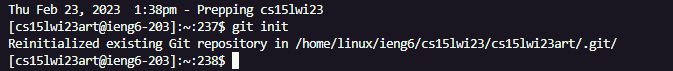
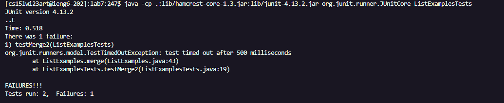
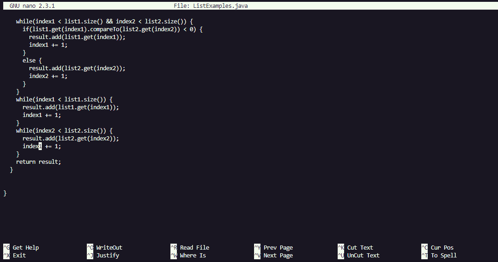
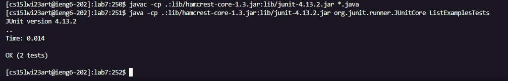
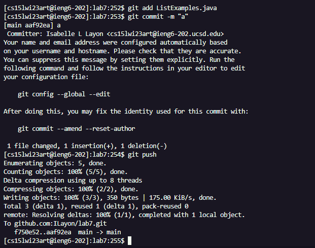

# CSE Labs Done Quick - Isabelle Layon

## Steps 1-3 (preparation):
To set up the lab, I deleted the existing fork I had of the lab 7 repo and removed the copy inside of ieng6 using ``rm -rf lab7/``, 
forked a new copy of the repo, and started an online timer to track my pace.

## Step 4:

To log into ieng6, I pressed `Ctrl-R` and typed "s". After the command was found, I pressed ``<enter>``.
  

I then typed `git init` to intialize a git repo and pressed ``<enter>``.
  
## Step 5:

  
I used `Ctrl-R` and typed "cl" to find the command to clone the fork of the lab 7 repo, and pressed ``<enter>``.
  

  
To change into the "lab7/" directory I typed ``cd l``, then ``<tab>`` to use autocompletion, and then pressed ``<enter>``.
  
## Step 6:
  

  
The ``javac -cp .:lib/hamcrest-core-1.3.jar:lib/junit-4.13.2.jar *.java`` command was 17 up in my search history, so I pressed
``<up><up><up><up><up><up><up><up><up><up><up><up><up><up><up><up><up><enter>`` to find and use it. 
  

  
Next the ``java -cp .:lib/hamcrest-core-1.3.jar:lib/junit-4.13.2.jar org.junit.runner.JUnitCore`` command was 12 up in my search history,
so I pressed ``<up><up><up><up><up><up><up><up><up><up><up><up>`` to find it, then typed "List" + ``<tab>`` to autocomplete into "ListExamples" before I added
"Tests" and pressed ``<enter>``.
  
The junit tests show that there is a failure.
  
## Step 7:

  
I typed ``nano l`` + ``<tab>`` to autocomplete into ``nano ListExamples``, added a ".java", and pressed ``<enter>``.

  
Next I pressed ``Ctrl-W`` + "(while index2" to quickly find the location of the error, then pressed ``<enter>``.

To reach the "1" in "index1" I pressed ``<down><down><up><up><up><up><up><up><up>``, then I pressed ``<backspace>`` + "2" to change 
"index1" into "index2" and fix the error.
  
Lastly to save and exit nano I pressed ``Ctrl-O``, ``<enter>`` and ``Ctrl-X``.
  
## Step 8:
  

  
The ``javac -cp .:lib/hamcrest-core-1.3.jar:lib/junit-4.13.2.jar *.java`` command was 2 up in my search history, so I pressed
``<up><up><enter>`` to find and use it. 
  
Next the ``java -cp .:lib/hamcrest-core-1.3.jar:lib/junit-4.13.2.jar org.junit.runner.JUnitCore ListExamples.java`` command was also 2 up in my search history,
so I pressed ``<up><up><enter>`` to find and use it.

This time, the junit tests pass.
  
## Step 9:
  

  
I first pressed `Ctrl-R` + "ad" to find the ``git add ListExamples.java`` command, and pressed ``<enter>``.
  
Next I used `Ctrl-R` + "comm" to find the command ``git commit -m "a"``, and pressed ``<enter>``.
  
Lastly, I used `Ctrl-R` again, adding "pu" to find the command ``git push``, and pressed ``<enter>``. 
  
Now the changes have been successfully saved to my fork of the lab 7 repo on GitHub.
