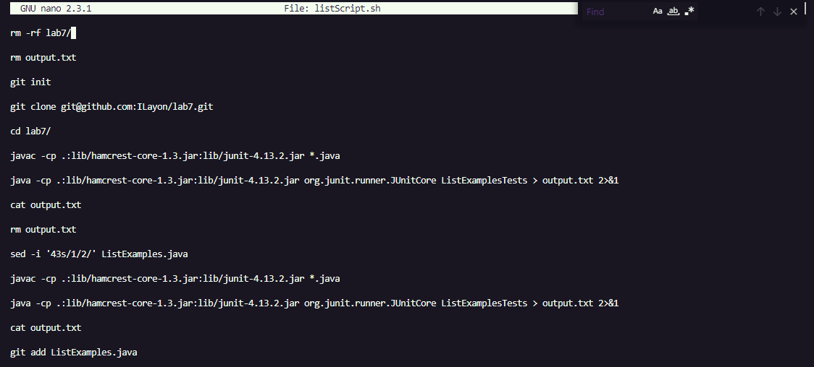
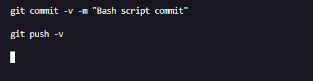
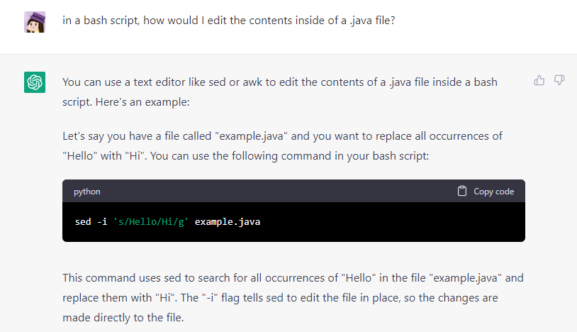
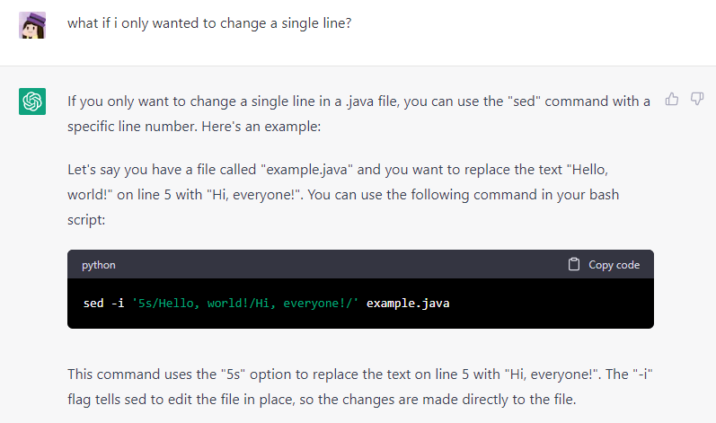
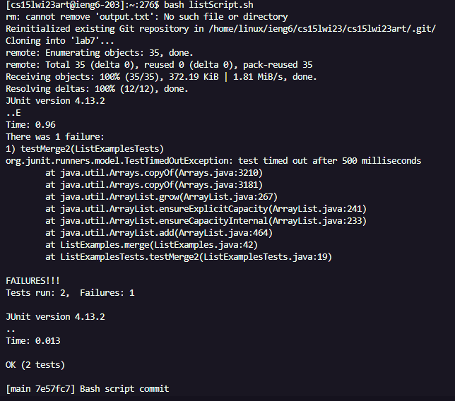
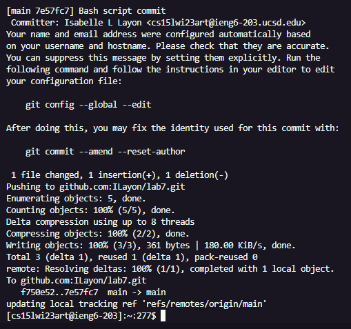
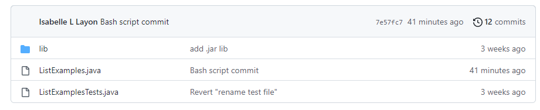

# CSE Labs Done Quicker - Isabelle Layon
> For this lab report, I chose to write a bash script in order to execute the commands from Lab Report 4 quicker than if I had executed them manually.

> **Citation:** I researched the `sed -i` command through prompting [ChatGPT.](https://chat.openai.com/)

## Step 1: Preparation

* First, I deleted my previous lab7 repo on my GitHub account, then created a fresh fork of the repo.
* Next, I decided to create a new bash script while already logged into ieng6. I first manually logged in, and then typed the command
`touch listScript.sh` to create the bash script. 
* To edit the bash script, I then entered the command `nano listScript.sh`.

## Step 2: Editing listScript.sh

* I began editing by looking through my steps from Lab Report 4 and copying them into my bash script, 
beginning with removing the lab7 directory and an output.txt file, and ending with the `git commit` and `git push` commands.
** I prompted ChatGPT in order to get help on editing the ListExamples.java file without using `nano` (elaborated on Step 3).
* I finished with this script:

* Lastly, I exited `nano` by pressing `Ctrl-O` and `enter` to save my bash script, and then `Ctrl-X`.

## Step 3: Prompting ChatGPT for help

* I was confused on how I could edit the `ListExamples.java` file through a bash script, since I would usually use
`nano` to edit the error, so I decided to ask ChatGPT for a command.

* ChatGPT suggested the `sed -i` command, which I was not familiar with. This command would search a file for specified text, and
replace it with new text which is also specified. I also asked how to use the command for a single line, since 
`index1 += 1` is supposed to occur on line 39 of `ListExamples.java`, but not on line 49. 

## Step 4: Using the bash script

* Lastly, it was time to use the bash script and see how much faster it would be compared to manually executing all of the commands.

* I started an online timer, then switched back to my terminal and entered `bash listScript.sh`. The commands worked as expected:

* After the commands executed, I checked back on the timer and only 18 seconds had passed, which is much much quicker than
if I had been manually doing the commands.

* I also double checked that the changes were committed and pushed to GitHub, which they successfully were.

* Overall, although it may take some time to create and edit a bash script, it can save a lot of time in the long term especially if
certain commands need to be used frequently. 
